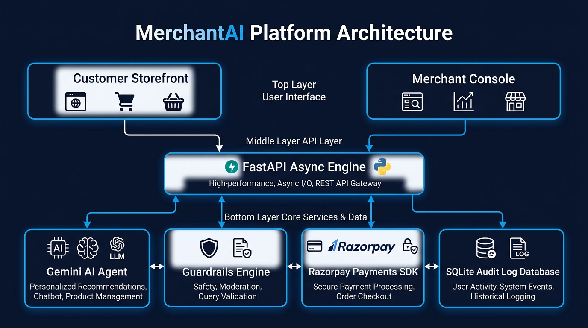

<p align="center">
  
  
  
  
  
  
</p>

<h1 align="center">MerchantAI</h1>

<h2 align="center">Razorpay AI Buildathon 2026 — Track 01: AI Growth &amp; Agentic Commerce</h2>

<h3 align="center">Autonomous Agentic Commerce Infrastructure</h3>

<p align="center">
  <a href="https://merchantai-smda.onrender.com" target="_blank">
    
  </a>
</p>

<p align="center">
  <em>A production-grade agentic commerce system for e-commerce merchants - featuring deterministic hard-coded guardrails, dual-portal architecture, real-time audit logging, automated cart recovery campaigns, and native Razorpay integration.</em>
</p>

<p align="center">
  <a href="https://merchantai-smda.onrender.com" target="_blank"><strong>Live Demo</strong></a> &bull;
  <a href="#project-overview">Project Overview</a> &bull;
  <a href="#key-features">Key Features</a> &bull;
  <a href="#system-architecture">Architecture</a> &bull;
  <a href="#agentic-guardrails">Guardrails & Bounds</a> &bull;
  <a href="#quick-start">Quick Start</a> &bull;
  <a href="#project-structure">Project Structure</a>
</p>

---

## Project Overview

MerchantAI is an autonomous commerce platform built for modern merchants. It bridges conversational AI and payment infrastructure by wrapping LLM interactions inside strict, code-enforced guardrails.

Traditional chat assistants often hallucinate discounts or make unauthorized commitments. MerchantAI prevents this by routing all actions through a deterministic **Bounds Checker** and **Payment Gate**, ensuring zero loss of revenue while providing a fluid customer shopping experience.

---

## Key Features

- **Dual-Portal Role Gateway**: Instant switching between Customer Storefront (Buyer) and Merchant Console (Merchant) without re-authenticating.
- **Conversational Copilot**: Powered by Gemini API with function calling to search catalogs, answer product queries, apply discounts, and manage cart state.
- **Direct & AI Checkout**: Customers can check out directly from the storefront or through the conversational assistant using native Razorpay Checkout JS.
- **Hard-Coded Guardrails**: Bounded discount percentages (max 15%), bounded cart quantities (max 5 items), and bounded order totals enforced at the code layer.
- **Human-in-the-Loop Gate**: All financial transactions require explicit human confirmation before invocation of payment endpoints.
- **Real-Time Audit Trail**: Every search, cart modification, discount application, and payment signature verification is logged with structured reasoning and timestamp.
- **Cart Recovery Orchestrator**: Automated background campaign engine that identifies abandoned carts, calculates safe recovery discounts, and dispatches personalized customer recovery messages.

---

## System Architecture

<p align="center">
  
</p>

---

## Agentic Guardrails

MerchantAI uses a multi-layered guardrail engine to prevent unauthorized agent behavior:

| Guardrail Layer | Enforcement Mechanism | Limit / Threshold |
|---|---|---|
| Cart Quantity Bounds | Hard-Coded Validation | Maximum 5 items per single product |
| Discount Bounds | Hard-Coded Margin Check | Maximum 15 percent total discount |
| Negotiation Limit | State Machine Counter | Maximum 3 rounds of price negotiation |
| Order Amount Limit | System Boundary Rule | Maximum 50,000 INR order value |
| Payment Gate | Explicit User Confirmation | Required before creating Razorpay Order |

---

## Quick Start

### Prerequisites
- Python 3.11+
- Node.js 18+
- Git

### Installation

1. **Clone the Repository**
```bash
git clone https://github.com/Jeet-Paghdar/MerchantAi.git
cd MerchantAi
```

2. **Backend Setup**
```bash
cd backend
python -m venv venv
venv\Scripts\activate
pip install -r requirements.txt
```

3. **Frontend Setup**
```bash
cd ../frontend
npm install
npm run build
```

4. **Environment Variables**
Create `.env` in the root directory:
```env
GEMINI_API_KEY=your_gemini_api_key
RAZORPAY_KEY_ID=your_razorpay_key_id
RAZORPAY_KEY_SECRET=your_razorpay_key_secret
```

5. **Start Application**
```bash
cd ../backend
uvicorn main:app --host 0.0.0.0 --port 8000
```

Open `http://localhost:8000` in your web browser.

---

## Project Structure

```text
MerchantAi/
├── backend/
│   ├── agent/                 # Gemini Agent core, tools, prompts, and bounds
│   ├── audit/                 # Audit logger and audit trail API endpoints
│   ├── campaigns/             # Cart recovery orchestrator and messaging engine
│   ├── catalog/               # Product models, seed data, and catalog API
│   ├── checkout/              # Razorpay integration, cart models, and checkout router
│   ├── config.py              # Environment settings and guardrail parameters
│   ├── database.py            # SQLAlchemy database initialization
│   └── main.py                # FastAPI entry point and static asset server
├── docs/
│   └── architecture.jpg       # Platform architecture diagram
├── frontend/
│   ├── src/
│   │   ├── components/        # Storefront, ChatWindow, PaymentGate, AuditTrail
│   │   ├── api.js             # API integration client
│   │   └── App.jsx            # Dual-portal state and main layout manager
│   ├── package.json           # Node dependencies
│   └── vite.config.js         # Vite configuration
├── build.sh                   # Render deployment build script
├── render.yaml                # Render blueprint specification
└── README.md                  # Project documentation
```

---

## Live Deployment

- **Live URL**: [https://merchantai-smda.onrender.com](https://merchantai-smda.onrender.com)
- **Hosted On**: Render Cloud
- **Payment Engine**: Razorpay Test Mode
